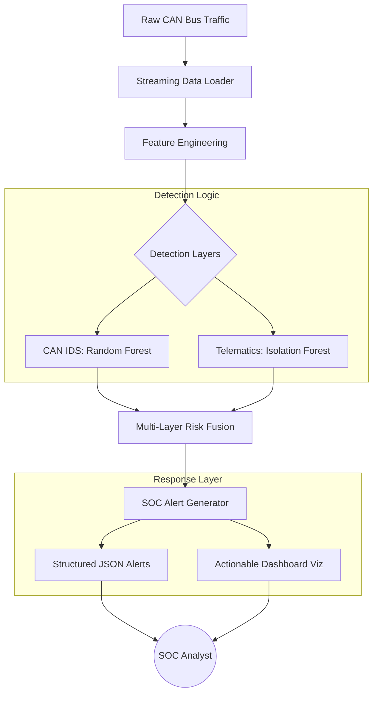

# 🛡️ Automotive Intrusion Detection System (AIDS)

[](https://www.python.org/)
[](https://scikit-learn.org/)
[](https://opensource.org/licenses/MIT)

A robust, multi-layer security framework for modern vehicles. This system combines **CAN Bus traffic analysis** with **Telematics anomaly detection** to provide a comprehensive defense-in-depth against cyber attacks.

---

## ⚡ Core Features

- **Real-world Data Integration**: Built and validated using the HCRL Car-Hacking Dataset.
- **Multi-Model Analysis**: Utilizes Random Forest for high-accuracy classification and Isolation Forest for unsupervised anomaly detection.
- **Telematics Behavioral Monitoring**: A secondary detection layer that monitors vehicle speed, RPM, and sensor data for secondary validation.
- **SOC Alert Engine**: Automatically converts mathematical anomalies into structured, human-readable security alerts (JSON & DataFrames).
- **Deployment Optimized**: Includes detailed analysis for Edge/Cloud hybrid architectures and resource-constrained ECU environments.

---

## 📊 Detection Pipeline

The system processes raw vehicle data through a sophisticated multi-stage pipeline:



---

## 🛠️ Installation & Setup

1.  **Clone the Repository**:

    ```bash
    git clone https://github.com/your-username/car-intrusion.git
    cd car-intrusion
    ```

2.  **Download the Dataset**:
    - Place the HCRL CSV files (DoS, Fuzzy, Gear, RPM) in the `data/` folder.

3.  **Install Dependencies**:

    ```bash
    pip install pandas numpy scikit-learn matplotlib seaborn
    ```

4.  **Run the Analysis**:
    - Open `model.ipynb` in VS Code or Jupyter and execute all cells.

---

## 🚦 Alert Severity Engine

The SOC module classifies alerts based on the combined confidence of all detection layers:

| Severity      | Description                   | Recommended Action                        |
| :------------ | :---------------------------- | :---------------------------------------- |
| **🔴 HIGH**   | Confirmed multi-layer anomaly | Immediate investigation; Isolate ECU.     |
| **🟡 MEDIUM** | Single-layer trigger          | Monitor closely; Verify telemetry.        |
| **🔵 LOW**    | Minor signal irregularity     | Log for review; Check sensor calibration. |

---

## 📂 Project Structure

- `model.ipynb`: Core research and implementation notebook.
- `alerts.json`: Generated output for SIEM integration.
- `data/`: (Ignored) HCRL raw dataset folder.
- `.gitignore`: Optimized for large-scale ML project pushes.

---

_Project developed for Advanced Automotive Cybersecurity Research._
